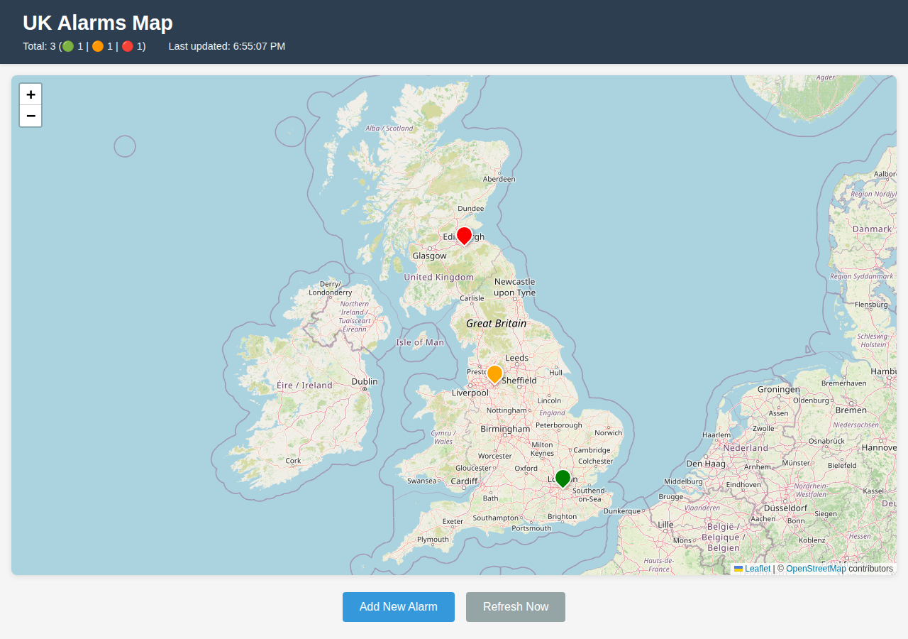
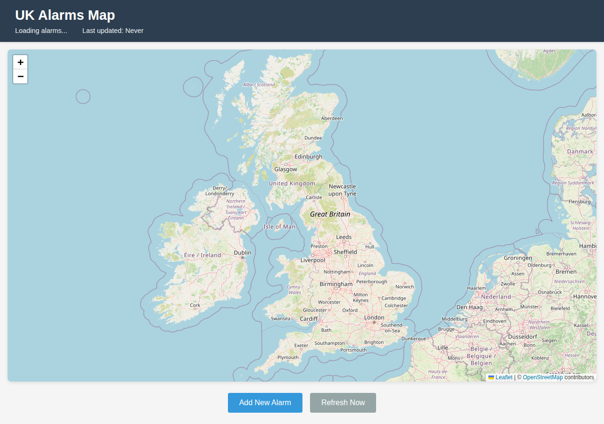
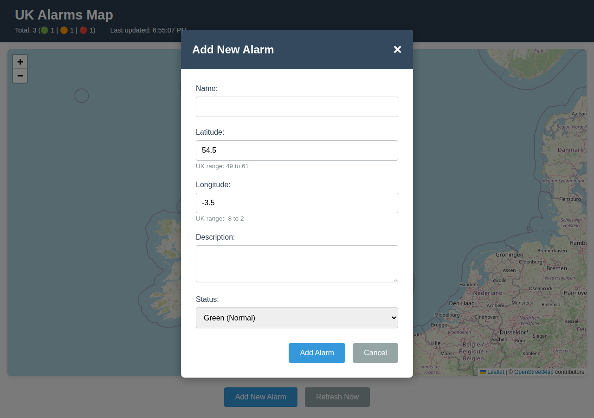
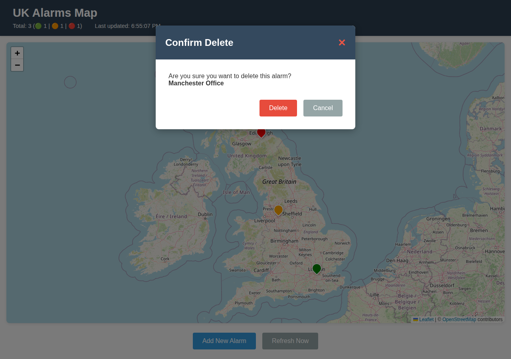

# UK Alarms Map – User Flows

This document describes the key user flows for the **UK Alarms Map** web application and includes screenshots captured from the running application.

---

## Application Overview

The UK Alarms Map is a browser-based dashboard that displays geographic alarm markers on an interactive UK map. Users can:

- View all current alarms plotted on a map of the United Kingdom
- Monitor alarm statistics (total count, green / amber / red breakdown)
- Add new alarms at any UK location
- Delete existing alarms via a map-marker popup
- Manually refresh the alarm list at any time

The application polls the remote REST API every **60 seconds** to keep data current.

---

## User Flow 1 – View the Alarm Dashboard

**Trigger:** User navigates to the application URL.

**Steps:**
1. Browser loads the page and the Leaflet map initialises, centred on the UK.
2. The header shows *"Loading alarms…"* while the initial API fetch is in progress.
3. Once data arrives, map markers appear for each alarm and the header updates with counts.

**Expected outcome:**
- Page title reads *"UK Alarms Map - MarkMap"*
- Header contains **"UK Alarms Map"** heading
- Alarm count shows `Total: N (🟢 G | 🟠 A | 🔴 R)` values
- *Last updated* timestamp is set to the current time
- **Add New Alarm** and **Refresh Now** buttons are visible

### Screenshot – Home page (alarms loaded)

### Screenshot – Initial loading state

---

## User Flow 2 – Add a New Alarm

**Trigger:** User clicks the **Add New Alarm** button.

**Steps:**
1. The *Add New Alarm* modal appears with a slide-down animation.
2. The form pre-fills **Latitude** with `54.5` and **Longitude** with `-3.5` (approximate UK centre).
3. User enters a **Name** (required), adjusts co-ordinates, optionally adds a **Description**, and selects a **Status** (`green`, `amber`, or `red`).
4. User clicks **Add Alarm**.
5. The application POSTs the new alarm to the API.
6. On success, the modal closes, a confirmation alert is shown, and the alarm list is refreshed.

**Form fields:**

| Field | Type | Required | Validation |
|-------|------|----------|------------|
| Name | Text | ✅ | Must not be empty |
| Latitude | Number | ✅ | 49 – 61 (UK range) |
| Longitude | Number | ✅ | -8 – 2 (UK range) |
| Description | Textarea | ❌ | — |
| Status | Select | ✅ | Green / Amber / Red |

**Dismiss the modal without saving:** click the **×** close button, the **Cancel** button, or click outside the modal overlay.

### Screenshot – Add New Alarm modal (empty)

### Screenshot – Form with values entered

---

## User Flow 3 – Delete an Alarm

**Trigger:** User clicks a map marker, then clicks **Delete** inside the popup.

**Steps:**
1. User clicks a coloured map marker.
2. A Leaflet popup appears showing the alarm's name, status badge, co-ordinates, and description.
3. User clicks the red **Delete** button in the popup.
4. The *Confirm Delete* modal appears, showing the alarm's name.
5. User clicks **Delete** to confirm.
6. The application sends a `DELETE` request to the API.
7. On success, a confirmation alert is shown and the map is refreshed.

**Dismiss without deleting:** click the **×** close button or the **Cancel** button.

### Screenshot – Confirm Delete modal

---

## User Flow 4 – Refresh Alarms Manually

**Trigger:** User clicks **Refresh Now**.

**Steps:**
1. User clicks the **Refresh Now** button in the controls bar.
2. The application sends a fresh `GET` request to the API.
3. The map markers and statistics header update to reflect the latest data.
4. The *Last updated* timestamp resets to the current time.

---

## User Flow 5 – Automatic Polling

**Trigger:** Automatic (every 60 seconds after page load).

**Steps:**
1. After the initial page load the application starts a 60-second interval timer.
2. Every 60 seconds `loadAlarms()` is called automatically.
3. Map markers and statistics update without any user action.

---

## User Flow 6 – Error Handling

If the API returns an error (non-2xx status or network failure) during any operation the application:

- Logs the error to the browser console.
- Displays an `alert()` dialog with a human-readable message:
  - **Load failure:** *"Failed to load alarms. Please try again."*
  - **Add failure:** *"Failed to add alarm. Please try again."*
  - **Delete failure:** *"Failed to delete alarm. Please try again."*
